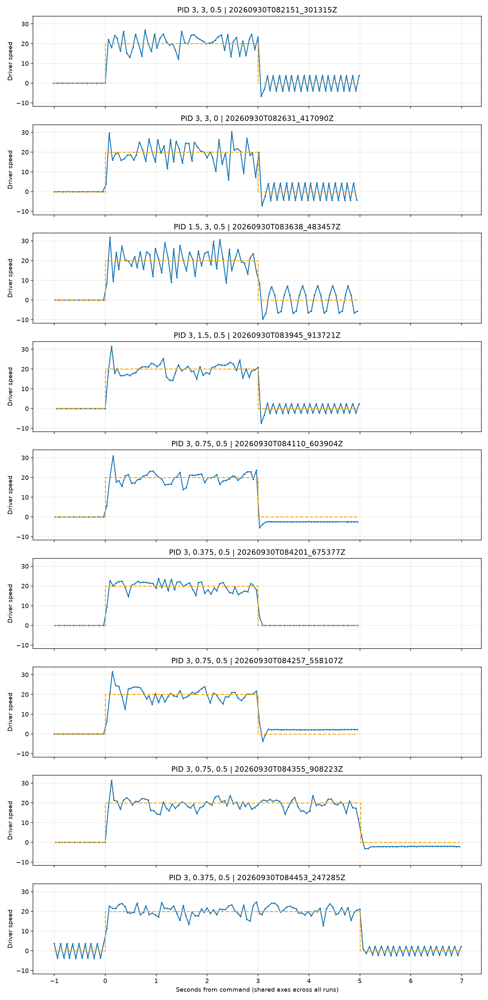
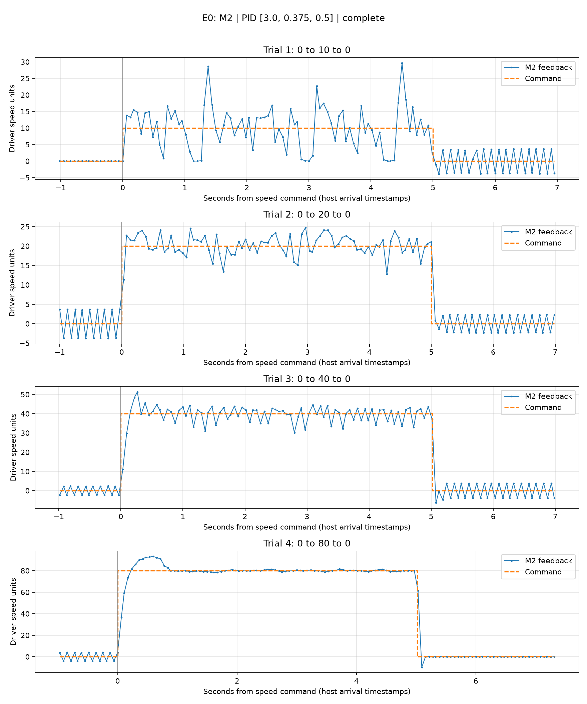

# E0 results - motor PID tuning over direct USB

Raw runs in `results/` are Git-ignored; this file and `images/` are the committed summary. Full run table and statistics: [TUNING_RESULTS.md](TUNING_RESULTS.md).

## What was tested

Nine sweeps on **M2 only** through the driver's USB serial, targets 10-80 (driver speed units), comparing PID settings. Pulse line **2000**, dead zone 1650, ratio 23.

## Confirmed

- Reducing **P** from 3 to 1.5 made 20-unit tracking worse.
- Reducing **I** with P=3, D=0.5 improved sustained tracking; **P=3, I=0.375, D=0.5** was left stored as the working candidate. At target 80 its final-second std dev was 0.58 (I=0.75: 2.80).
- Zero-speed hunting was not reliably removed.
- **Target 10 stays poor**: feedback drops near zero and then bursts toward 30.

## Important caveat added later

E0 used pulse line 2000. E2 showed that this value makes the driver run the wheel about **4x faster than the commanded speed**, so E0's targets were physically 4x higher than nominal. The relative PID comparison is still informative, but the low-speed conclusions (target 10 and 20) should be re-checked with pulse line 500.

## Plots

Low-speed (target 20) traces with shared axes:

Final candidate P=3, I=0.375, D=0.5, targets 10/20/40/80:

