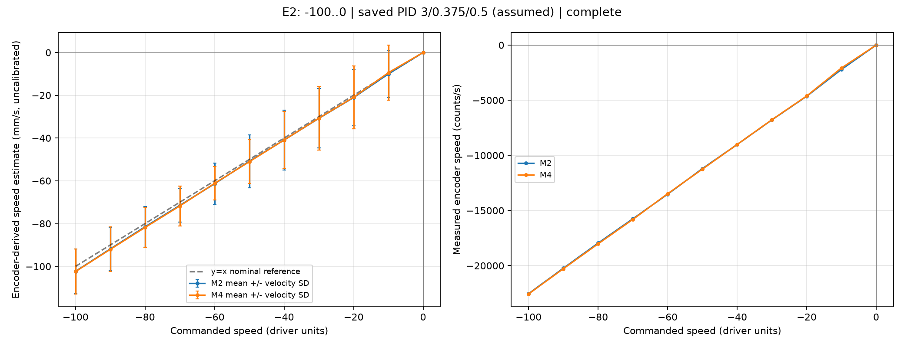
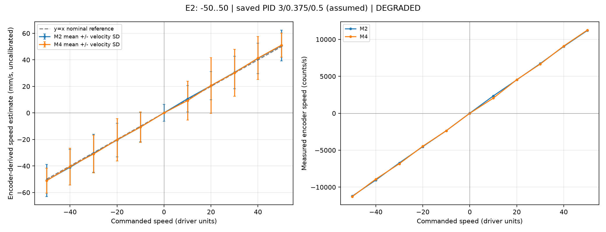
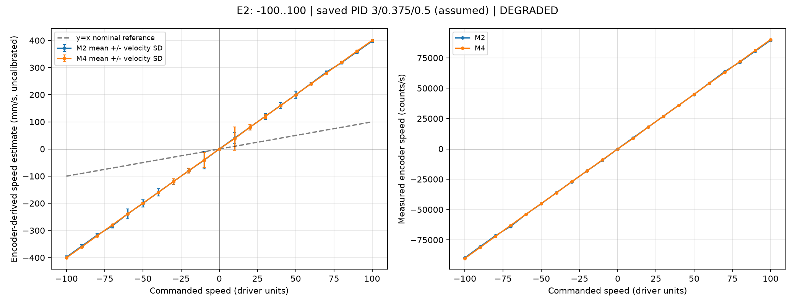

# E2 results - commanded versus measured speed

Raw runs are in `results/` and are Git-ignored; this file and `images/` are the committed summary.
See the [README](README.md) for method and phases. All runs: I²C 400 kHz, M2 and M4 commanded together, closed-loop speed command (register `0x06`), type 1, dead zone 1650, ratio 23, diameter 65 mm, PID 3/0.375/0.5 assumed stored.

## What has been tested

| Run (local folder) | Sweep | Pulse line | Outcome |
| --- | --- | ---: | --- |
| `20260930T093006_074421Z` | -100 to 100, step 10 | 2000 | Complete; 4 USB lines dropped, flagged degraded |
| `20260930T104116_833929Z` | -50 to 50, step 10 | 500 | Complete; 7 USB lines dropped, flagged degraded |
| `20260930T104659_190065Z` | -100 to 0, step 10 | 500 | Complete, no drops |

## Confirmed

- **The full sweep runs to completion over I²C** with no bus errors and no missed 50 Hz ticks: 2,750 rows for 11 targets, 5,250 for 21.
- **Pulse line must be 500, not 2000.** Hand-turning one wheel revolution gave 44,998 encoder counts, which is 500 ppr x 4 x 22.5. With pulse line 2000 the wheel ran about **4x faster** than commanded (estimated 398 mm/s at command 100); with 500 the estimate is about 100 mm/s.
- **With pulse line 500, measured speed tracks the command within about 5%** from |command| 20 to 100 (about 2-3% above 30), for both motors and both signs (values are estimated mm/s from counts):

  | Command | M2 | M4 |
  | ---: | ---: | ---: |
  | -100 | -102.3 | -102.4 |
  | -50 | -50.8 | -51.1 |
  | 50 | 50.8 | 51.1 |

  The two motors agree within about 1-2% at these speeds.
- **The command sign gives opposite rotation** on both motors (negative command counts negative). Which sign is vehicle-forward is **not** mapped yet.
- **Transaction cost at 400 kHz:** a speed write takes 273-313 µs. Eight word reads take about 1.41 ms (each 32-bit total count costs three reads, about 0.53 ms).

## Observations that are not fully resolved

- **Low speed is bursty.** At command 10 and 20 the wheel intermittently stops and restarts; recent counts fall to 0 for stretches. The average over the 2 s window (about 10 mm/s estimated at command 10, though M4 read 9.3 at +10) hides this. Consistent with the E0 target-10 observation.
- **Zero speed hunts slightly.** At rest the driver's PID alternates the count by about ±40 counts (roughly 0.3 mm of wheel travel).
- **Dropped USB output.** 4-7 rows in some runs were dropped by the firmware when the USB buffer was full. Speed calculations tolerate this; the analyzer still marks such runs degraded.

## Not established

- Physical speed: mm/s is derived from 44,998 counts per revolution and a nominal 65 mm diameter, not measured against distance.
- Which command sign is forward.
- Behavior under rapid target changes, cornering, or vehicle load.
- Stored PID (assumed, never read back).

## Plots

Left: estimated speed against command; right: raw counts per second.

**Pulse line 500, -100 to 0** (clean run):

**Pulse line 500, -50 to 50** (both signs; 7 dropped rows):

**Pulse line 2000, -100 to 100** (about 4x too fast; kept as the evidence for the correction):

